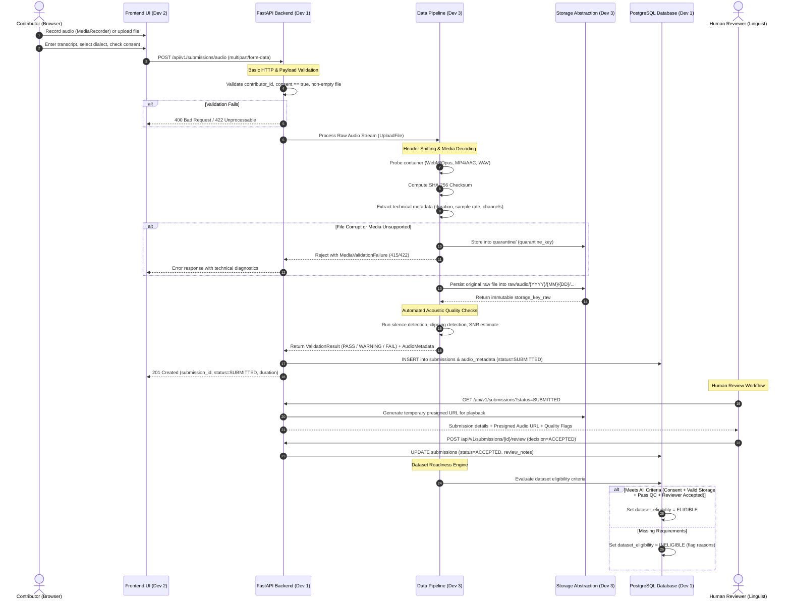
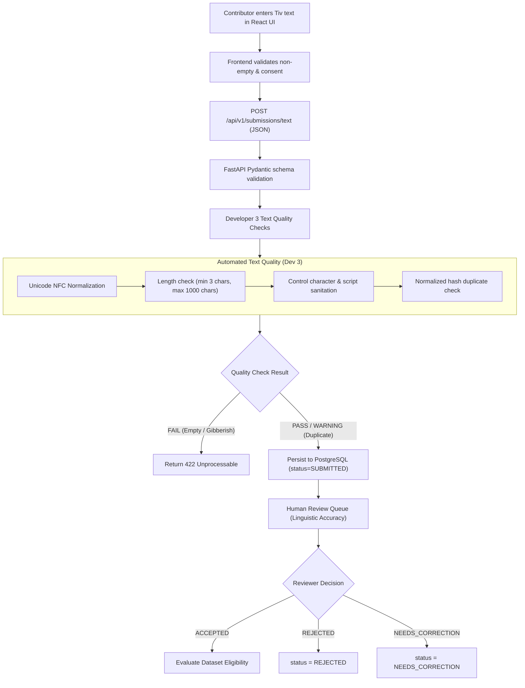
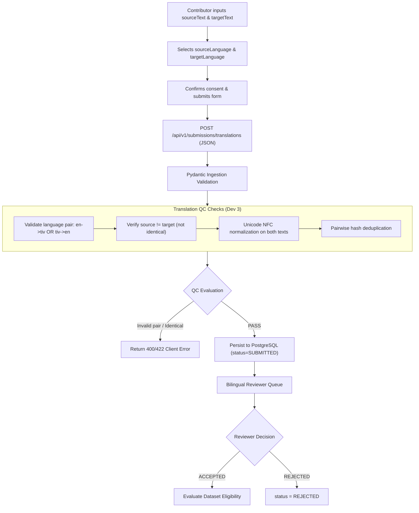

# Data Flow Architecture — Tiv AI Platform

## 1. Overview & Data Ingestion Modalities

The Tiv AI platform ingests three primary data modalities through distinct submission pipelines:
1. **Monolingual Tiv Text**
2. **Bidirectional English ↔ Tiv Translation Pairs**
3. **Spoken Tiv Audio & Accompanying Transcripts**

Each data stream progresses through defined lifecycle stages:
```
Submission Ingestion 
  ──► In-Flight Validation 
  ──► Immutable Storage & Checksum 
  ──► Automated Quality Analysis 
  ──► Database Indexing 
  ──► Human Review Queue 
  ──► Dataset Eligibility Evaluation 
  ──► Versioned Manifest Export
```

---

## 2. Ingestion Flow: Spoken Tiv Audio

Audio contributions present the highest technical complexity, requiring binary file handling, header verification, acoustic quality checks, cryptographic hashing, and dual-tier storage (raw vs. canonical derived).

### 2.1 Detailed Audio Lifecycle Flow



### 2.2 Audio Ingestion Stages

1. **Client Capture (`Developer 2`)**:
   - Captured in browser via `MediaRecorder` API (preferring `audio/webm;codecs=opus`, falling back to `audio/mp4` on Safari/iOS) or uploaded as pre-recorded audio file.
   - Sent as `multipart/form-data` with fields: `audio_file`, `contributor_id`, `transcript`, `dialect`, `consent`.
2. **Transport & Ingestion Gateway (`Developer 1`)**:
   - FastAPI intercepts upload via `UploadFile`.
   - Rejects unconsented submissions (`consent != true`) immediately with `400 Bad Request`.
   - Enforces preliminary file size guardrail (< 25 MB).
3. **Audio Inspection & Security Quarantine (`Developer 3`)**:
   - The raw byte stream is read in chunks to calculate a cryptographic `SHA-256` hash.
   - Media container and audio stream are parsed using binary header probes (preventing arbitrary file execution or disguised payloads).
   - If the audio header is malformed, truncated, or un-decodable, the file is moved to the `quarantine/` namespace, and an error is returned.
4. **Immutable Raw Storage (`Developer 3`)**:
   - The verified original byte stream is saved immutably into `raw/audio/{YYYY}/{MM}/{DD}/{submission_id}_{hash[:8]}.{ext}`.
   - The original file is **never modified, re-encoded, or overwritten**.
5. **Acoustic Quality Analysis (`Developer 3`)**:
   - Audio is analyzed for:
     - Minimum duration (≥ 0.5s) and maximum duration (≤ 120.0s).
     - Full file silence (peak amplitude < -60 dBFS).
     - Digital clipping percentage (> 2% clipped samples generates a `WARNING`).
     - Signal-to-Noise Ratio (SNR) estimation.
6. **Metadata & Status Persistence (`Developer 1`)**:
   - Technical metadata (codec, sample rate, channels, bit depth, duration, checksum) and initial quality status (`PASS` or `WARNING`) are written to PostgreSQL.
   - The submission status is set to `SUBMITTED`.
7. **Linguistic Review (`Developer 1 / Developer 2`)**:
   - Tiv community reviewers listen to audio using temporary private presigned URLs and compare it to the transcript and dialect.
   - Reviewer enters `decision` (`ACCEPTED`, `REJECTED`, or `NEEDS_CORRECTION`).
8. **Dataset Eligibility Gating (`Developer 3`)**:
   - Acceptance by a reviewer triggers the eligibility evaluator.
   - If the submission satisfies consent, provenance, raw storage existence, and passing quality criteria, its status transitions to `ELIGIBLE`.

---

## 3. Ingestion Flow: Monolingual Tiv Text



### Steps:
1. **Frontend Input**: User submits `tivText`, `source`, `dialect`, and `consent`.
2. **API Schema Validation**: Pydantic validates field presence and length constraints.
3. **Normalization & Sanitization**: Text is normalized to Unicode Canonical Decomposition followed by Canonical Composition (`NFC`), stripping zero-width spaces and unprintable control characters.
4. **Duplicate Hashing**: SHA-256 of the normalized text is checked against an index of accepted texts.
5. **Persistence**: Record inserted into `submissions` and `text_submissions` tables with status `SUBMITTED`.
6. **Human Review**: Reviewer verifies that the text is authentic Tiv orthography and grammatically sound.

---

## 4. Ingestion Flow: English ↔ Tiv Translation Pairs



### Steps:
1. **Direction Validation**: Verifies that translation pair represents either `en → tiv` or `tiv → en`.
2. **Identity Guard**: Rejects submissions where `sourceText == targetText` unless flagged as a specialized loanword.
3. **Cross-language Token Checks**: Verifies non-trivial length ratio (e.g. 1 English word translated to 500 Tiv characters indicates spam/malformed data).
4. **Persistence & Triage**: Stored with metadata indicating language directions and dialect tags.
5. **Bilingual Review**: Reviewers verify translation adequacy and natural fluency.

---

## 5. Architectural Distinction: Core Artifact Concepts

To prevent architectural ambiguity between storage layers, database states, and machine learning pipelines, the platform strictly differentiates six core concepts:

| Concept | Definition | Storage Location | Mutability |
| :--- | :--- | :--- | :--- |
| **1. Raw Contribution** | The exact, unmodified byte stream submitted by the browser (WebM, MP4, WAV, raw text). | Object Store: `raw/` | **Immutable** |
| **2. Processed / Derived Artifact** | Standardized, normalized transformation (e.g. 16 kHz 16-bit mono WAV, NFC-normalized text). | Object Store: `processed/` | Reproducible / Regenerable |
| **3. Database Metadata** | Relational records capturing submission parameters, technical audio metrics, timestamps, and hashes. | PostgreSQL (`submissions`, `audio_metadata`) | Transactional |
| **4. Review State** | The human linguistic assessment (`SUBMITTED`, `UNDER_REVIEW`, `ACCEPTED`, `REJECTED`, `NEEDS_CORRECTION`). | PostgreSQL (`submissions.review_status`) | State-machine controlled |
| **5. Dataset Eligibility** | Rule-governed boolean/enum determining if a record satisfies all governance, quality, and review gates. | PostgreSQL (`submissions.dataset_eligibility`) | Deterministic Rule Evaluation |
| **6. Dataset Membership** | The inclusion of an eligible record inside a frozen, immutable versioned dataset release (e.g. `TIV-DATASET-0001`). | Object Store: `exports/` (JSONL manifests) | **Immutable** snapshot |

---

## 6. Traceability & Audit Trail Guarantee

Every downstream machine learning sample must maintain verifiable provenance back to its origin:

```
ML Sample (e.g. ASR Audio Chunk)
  └── Manifest Reference (e.g. manifest.jsonl in TIV-DATASET-0001)
        └── Submission ID (UUIDv7)
              ├── Contributor ID (Pseudonymous ID)
              ├── Consent Record (Version "v1.0", Timestamp, Consent Hash)
              ├── Raw File Checksum (SHA-256 matches raw storage object)
              ├── Quality Validation Log (Automated QC outputs)
              └── Reviewer Decision Log (Reviewer ID, Timestamp, Review Notes)
```

If an error, bias, or consent revocation occurs at any point in the lifecycle, the audit trail enables immediate surgical identification and exclusion of affected artifacts without corrupting the remainder of the corpus.
