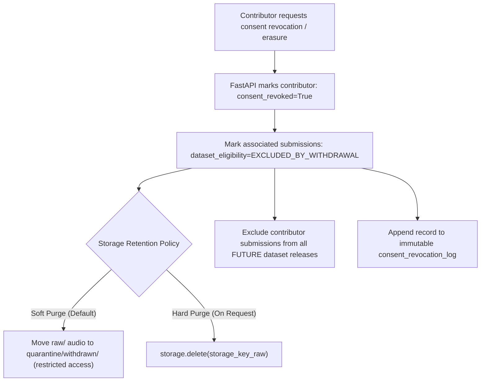

# Storage Architecture — Tiv AI Platform

## 1. Design Principles & Goals

The storage architecture for the Tiv AI Data Collection Platform is built on five core architectural principles:

1. **Provider Agnosticism**: Application code never interacts directly with underlying storage drivers (`os.path`, local file handles, or AWS `boto3` calls). All I/O operations are mediated through a unified `StorageBackend` abstraction.
2. **Localhost & Cloud Parity**: Developers can run, test, and debug the entire data and audio storage lifecycle locally on their workstations using a local directory (`.storage/`), while staging and production environments seamlessly switch to private S3-compatible object storage via environment configuration.
3. **Immutability of Original Contributions**: The raw binary files submitted by contributors are immutable. Once written to `raw/`, they are never edited, overwritten, or re-encoded in place. Derived formats (e.g. 16 kHz mono WAV for ASR) are written to `processed/`.
4. **Authoritative Key Generation**: User-supplied filenames (such as `recording.webm` or `my_voice.wav`) are treated strictly as informational metadata. Storage keys are generated server-side using collision-resistant, date-partitioned identifiers and content hashes.
5. **Private by Default**: Storage containers allow zero public access. All audio retrieval for reviewers and contributors is mediated by short-lived, cryptographically signed presigned URLs or authenticated streaming endpoints.

---

## 2. Storage Namespaces

Storage objects are partitioned into four isolated logical namespaces:

```
storage-root/
├── raw/
│   └── audio/
│       └── {YYYY}/
│           └── {MM}/
│               └── {DD}/
│                   └── {submission_id}_{content_hash[:8]}.{ext}
├── processed/
│   └── audio/
│       └── asr_canonical_16khz/
│           └── {YYYY}/
│               └── {MM}/
│                   └── {submission_id}_16k_mono.wav
├── quarantine/
│   └── {YYYY}/
│       └── {MM}/
│           └── {quarantine_id}_{reason}.bin
└── exports/
    └── datasets/
        └── {dataset_version}/   (e.g., TIV-DATASET-0001/)
            ├── manifest.jsonl
            ├── dataset_metadata.json
            └── audio/
                └── ...
```

### Namespace Definitions:

| Namespace | Access Policy | Retention | Purpose |
| :--- | :--- | :--- | :--- |
| `raw/` | Private, Read-Only | Permanent (subject to consent withdrawal) | Unmodified, exact byte stream submitted by contributor. Source of truth for all future processing. |
| `processed/` | Private, Read-Only | Regenerable | Canonical normalized derivatives (e.g. 16 kHz 16-bit PCM mono WAV for speech training). |
| `quarantine/` | Restricted Admin | 30-Day TTL | Corrupt, truncated, malformed, or malicious uploads isolated from ingestion processing for security review. |
| `exports/` | Private / Controlled | Permanent Frozen Snapshots | Versioned dataset releases, manifests, splits (train/dev/test), and checksum archives. |

---

## 3. Storage Abstraction Interface Contract

Developer 3 provides a clean Python interface contract. Developer 1 and the data processing pipeline call these conceptual operations:

```python
from abc import ABC, abstractmethod
from typing import BinaryIO, Optional, Dict, Any
from dataclasses import dataclass
from datetime import datetime

@dataclass(frozen=True)
class StorageMetadata:
    key: str
    size_bytes: int
    content_type: str
    sha256_checksum: str
    created_at: datetime
    custom_metadata: Dict[str, str]

class StorageBackend(ABC):
    """Abstract interface contract for storage operations across Tiv AI environments."""

    @abstractmethod
    def save(
        self,
        key: str,
        data: BinaryIO,
        content_type: str,
        metadata: Optional[Dict[str, str]] = None,
    ) -> StorageMetadata:
        """Persist a binary data stream to the given key.
        
        Must raise an error if key already exists in an immutable namespace (raw/).
        """
        pass

    @abstractmethod
    def open_read(self, key: str) -> BinaryIO:
        """Open a read-only binary stream for the specified key.
        
        Raises FileNotFoundError if key does not exist.
        """
        pass

    @abstractmethod
    def exists(self, key: str) -> bool:
        """Check whether an object exists at the specified key."""
        pass

    @abstractmethod
    def delete(self, key: str) -> bool:
        """Delete the object at the specified key.
        
        Strictly restricted: Only permissible for quarantine cleanup or legal consent withdrawal.
        """
        pass

    @abstractmethod
    def get_metadata(self, key: str) -> StorageMetadata:
        """Retrieve technical metadata and checksum for the specified key."""
        pass

    @abstractmethod
    def generate_presigned_url(self, key: str, expires_in_seconds: int = 900) -> str:
        """Generate a time-limited URL for secure authenticated client playback."""
        pass
```

### Implementations:
1. **`LocalStorageBackend`**:
   - Backed by local directory (`.storage/` in project root).
   - Generates local file URLs or streams via FastAPI proxy endpoints (`/api/v1/media/{key}`).
   - Used for unit tests, offline development, and zero-dependency local runs.
2. **`S3StorageBackend`**:
   - Backed by AWS S3, Cloudflare R2, MinIO, or Google Cloud Storage.
   - Generates AWS SigV4 signed presigned GET URLs for secure, direct browser streaming.
   - Used for cloud staging and production deployments.

---

## 4. Key Generation & Naming Strategy

Under no circumstances may client-supplied filenames (e.g. `recording.webm` from `FormData`) be used as authoritative storage paths. Malicious filenames (such as `../../etc/passwd` or hidden script extensions) pose critical directory traversal risks.

### Standard Storage Key Patterns:
- **Raw Audio**:
  ```
  raw/audio/{YYYY}/{MM}/{DD}/{submission_id}_{hash_prefix}.{safe_extension}
  ```
  - `YYYY/MM/DD`: Date partitioning prevents directory-level inode exhaustion and simplifies S3 prefix partitioning.
  - `submission_id`: System-generated UUIDv7 (timestamp-ordered UUID) or cryptographically secure identifier.
  - `hash_prefix`: First 8 hexadecimal characters of the file's SHA-256 checksum.
  - `safe_extension`: Normalized extension derived from verified container probe (e.g. `webm`, `m4a`, `wav`, `ogg`), NOT the client-provided header.
  - *Example*: `raw/audio/2026/09/23/sub_01h8q7j4_a1b2c3d4.webm`

- **Processed Audio (ASR Canonical)**:
  ```
  processed/audio/asr_canonical_16khz/{YYYY}/{MM}/{submission_id}_16k_mono.wav
  ```

- **Quarantine Objects**:
  ```
  quarantine/{YYYY}/{MM}/{quarantine_id}_{reason}.bin
  ```

---

## 5. Consent Withdrawal & Right-to-Erasure Protocol

Respecting community trust and data protection regulations requires a concrete data deletion and exclusion protocol when a contributor revokes consent:



### Retention Policies:
1. **Future Releases**: Withdrawn contributions are instantly stripped of `ELIGIBLE` status and will never appear in subsequent dataset versions (`TIV-DATASET-xxxx`).
2. **Historical Releases**: Released and published datasets with cryptographic checksums are fixed research artifacts. However, a published **Revocation Index** (`revocations.jsonl`) will instruct researchers and downstream ML trainers to exclude those submission IDs from training splits.
3. **Object Storage Purge**: For hard deletion requests, `storage.delete(key)` removes the physical object from the storage backend, while database audit records preserve the anonymized transaction record noting the erasure date and justification.
