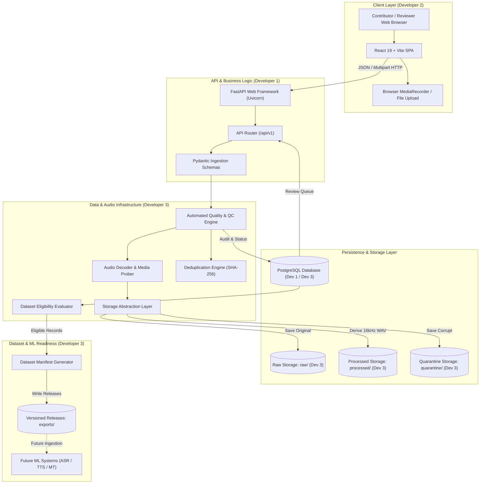

# System Architecture — Tiv AI Data Collection Platform

## 1. Executive Summary & Objective

The **Tiv AI Data Collection Platform** is a specialized, production-grade ingestion, validation, and review system designed to collect high-quality, ethically consented, and linguistically verified Tiv language data. The platform captures three core modalities:
1. **Monolingual Tiv Text** (proverbs, sentences, historical literature, everyday conversational text).
2. **English ↔ Tiv Translation Pairs** (bidirectional parallel corpora).
3. **Tiv Spoken Audio** (voice recordings accompanied by transcripts, dialect tags, and acoustic metadata).

The platform serves as the foundational data infrastructure for future speech recognition (ASR), machine translation (MT), conversational AI, and text-to-speech (TTS) systems for the Tiv language. **In accordance with Milestone 0 directives, model training is strictly out of scope for this phase.** The primary engineering goal is ensuring zero data loss, end-to-end provenance, strict consent tracking, automated quality validation, and seamless collaboration across three parallel engineering streams.

---

## 2. Engineering Team Ownership & Boundaries

To enable rapid, unblocked development across the team, system responsibilities are partitioned into three distinct engineering domains:

```
┌─────────────────────────────────────────────────────────────────────────────┐
│                       DEVELOPER 2: FRONTEND & UX                            │
│  - Contributor Web Portal (React 19, Vite)                                  │
│  - Contribution Forms (Text, Translation, Audio Recording / Upload)         │
│  - Browser Audio Capture (MediaRecorder API, Opus/WebM fallback)            │
│  - Informed Consent Gating & Contributor Dashboard                          │
│  - Reviewer UI & Audio Playback                                             │
└──────────────────────────────────────┬──────────────────────────────────────┘
                                       │ HTTP / REST / Multipart Form Data
                                       ▼
┌─────────────────────────────────────────────────────────────────────────────┐
│                    DEVELOPER 1: BACKEND, API & DATABASE                     │
│  - FastAPI Application & Routing (`/api/v1`)                                │
│  - PostgreSQL Relational Database (SQLAlchemy 2.0 ORM, Alembic Migrations)   │
│  - Pydantic Request/Response Schemas & Initial HTTP Validation              │
│  - Contributor Registration & Session State                                 │
│  - Review Queue Endpoints & Review Decision Persistence                     │
└──────────────────────────────────────┬──────────────────────────────────────┘
                                       │ Service Calls & Pipeline Invocations
                                       ▼
┌─────────────────────────────────────────────────────────────────────────────┐
│               DEVELOPER 3: DATA PIPELINE, AUDIO & DEVOPS                    │
│  - Storage Abstraction Layer (Local Filesystem ↔ S3-Compatible Object Store) │
│  - Media Inspection & Server-Side Audio Decoding Probe                      │
│  - Automated Quality Validation Engine (Silence, Clipping, Text Integrity)  │
│  - Cryptographic Checksums (SHA-256) & Deduplication Engine                 │
│  - Provenance Tracking & Consent Audit Gating                               │
│  - Dataset Eligibility Rules & Versioned Manifest Engine                    │
│  - Future ML Export Interfaces & Localhost / CI Environments                │
└─────────────────────────────────────────────────────────────────────────────┘
```

### Responsibility Matrix

| Area | Developer 1 (Backend/API) | Developer 2 (Frontend/UX) | Developer 3 (Data/Audio/DevOps) |
| :--- | :--- | :--- | :--- |
| **User Interface** | Provides OpenAPI specs | Builds React UI & Audio recorder | Reviews payload contracts |
| **API Endpoints** | Implements FastAPI routes | Consumes client via `api/client.js`| Defines ingestion/upload contracts |
| **Database** | Owns PostgreSQL & Alembic | Consumes API responses | Specifies metadata & audit fields |
| **Audio Storage** | Passes file stream to storage | Transmits `Blob` via FormData | Owns storage abstraction & keys |
| **Audio Probing** | Delegates to Dev 3 module | Sends client duration/MIME | Probes headers, codecs, sample rate |
| **Quality Control** | Triggers checks on submit | Displays validation feedback | Implements audio & text QC checks |
| **Review System** | Endpoints for review triage | Reviewer dashboard UI | Defines transition & eligibility rules |
| **Dataset Readiness**| Stores review decision | Visualizes status badges | Evaluates eligibility & manifest builds|
| **DevOps & CI** | Runs unit backend tests | Runs frontend linter/build | Owns Docker-compose, CI & storage configs|

---

## 3. High-Level Component Architecture

The Tiv AI platform operates as a modular monolith optimized for simplicity, low operational overhead, and robust local development. No Kubernetes or distributed microservice meshes are required for this phase.



---

## 4. Architectural Boundaries & Communication Patterns

### 4.1 Frontend to Backend (`Developer 2 → Developer 1`)
- **Transport**: HTTP/1.1 REST over TLS (Localhost uses plain HTTP).
- **Encoding**:
  - Text & Translation submissions: `application/json`.
  - Audio submissions: `multipart/form-data`.
- **Decoupling Strategy**: The frontend communicates strictly via the centralized API client located at `src/api/client.js`. A per-endpoint mock toggle (`USE_MOCKS` / `MOCK_ENDPOINTS`) ensures Developer 2 is never blocked while Developer 1 finishes endpoint implementations.

### 4.2 Backend to Data Pipeline (`Developer 1 ↔ Developer 3`)
- **Pattern**: Direct Python library/service invocation. Developer 3 provides pure, testable Python classes and service modules that Developer 1 imports directly into FastAPI dependencies and route handlers.
- **In-Memory Streaming vs Spooling**: Ingestion audio files are received as FastAPI `UploadFile` (spooled temporary files). Developer 3's media probe inspects the file header without loading unbounded files entirely into RAM, mitigating Denial of Service (DoS) memory exhaustion.
- **Storage Decoupling**: Database records store unique, immutable storage keys (`storage_key_raw`), not local filesystem paths or provider-dependent URIs.

### 4.3 Pipeline to Storage (`Developer 3 → Storage Backends`)
- **Pattern**: Storage Service Provider Interface (SPI).
- **Environments**:
  - **Local Development**: `LocalStorageBackend` writes directly to a designated local path (`.storage/raw/`, `.storage/processed/`).
  - **Staging / Production**: `S3StorageBackend` writes to AWS S3, Cloudflare R2, MinIO, or Google Cloud Storage via standard S3-compatible APIs using `boto3`.
- **Zero Provider Lock-in**: Code interacting with storage never calls `os.path` or S3 client methods directly; it operates solely against the abstract `StorageBackend` contract.

---

## 5. Security, Secrets & Privacy Architecture

1. **Zero Credential Commits**:
   - All credentials, storage keys, and database passwords must be loaded strictly from environment variables (`.env`).
   - `.env` is explicitly ignored by version control. A comprehensive `.env.example` document outlines all required configuration variables.
2. **Private Audio Access**:
   - Audio files stored in object storage are strictly private. The storage bucket must not permit public reads.
   - For reviewer playback and contributor playback, Developer 1's API generates short-lived presigned URLs (15-minute expiration) or proxies audio streams via authenticated endpoints.
3. **Data Minimization & Contributor Privacy**:
   - Submissions are tied to a pseudonymous `contributor_id`.
   - No direct personally identifiable information (PII) such as phone numbers, home addresses, or national identity numbers is gathered.
   - Contributor demographic information (age range, region, gender) is strictly optional and intended solely for acoustic balance in speech research.
4. **Consent as a Hard Dependency**:
   - Every submission requires explicit opt-in consent recorded with a consent version and timestamp. Unconsented data is rejected at the API gateway and never persisted to disk.

---

## 6. Localhost Development & Production Parity

To ensure rapid iteration for all developers, the system is designed to run seamlessly on a local workstation without requiring external cloud accounts or complex orchestration:

- **Local Development Stack**:
  - Frontend: Vite dev server (`http://localhost:5173`)
  - Backend: Uvicorn running FastAPI (`http://localhost:8000`)
  - Database: Local PostgreSQL or SQLite fallback for unit testing
  - Storage: Local filesystem (`.storage/` in project root, git-ignored)
- **Production Stack**:
  - Frontend: Static CDN deployment (Vercel, Cloudflare Pages, or Nginx)
  - Backend: Containerized FastAPI behind reverse proxy
  - Database: Managed PostgreSQL (AWS RDS or Supabase)
  - Storage: S3-compatible private bucket (AWS S3, MinIO, or Cloudflare R2)
