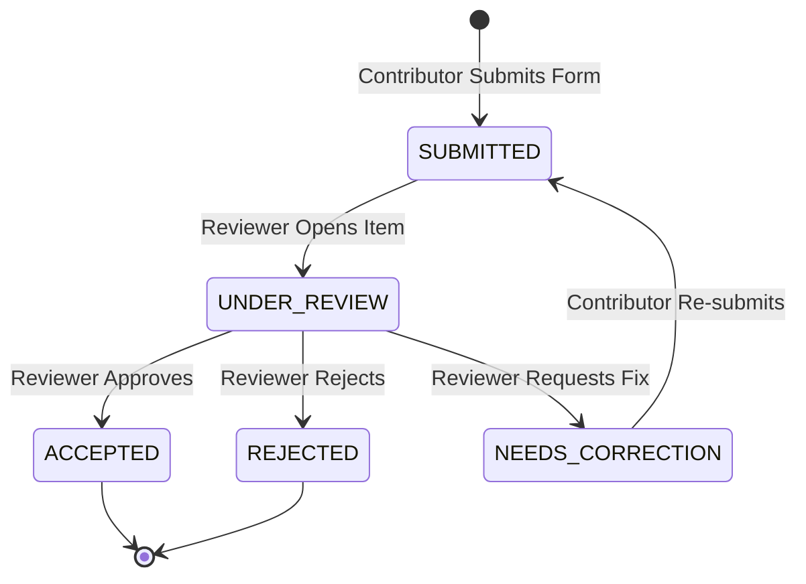

# Submission Lifecycle & State Transition Contract

## 1. Overview & Tri-State Architecture

To guarantee high scientific and ethical standards without overburdening human reviewers, the Tiv AI platform separates the lifecycle of a contribution into three decoupled, orthogonal states:

```
┌─────────────────────────────────────────────────────────────┐
│ 1. Submission Review Status (Human Linguistic Evaluation)   │
│    SUBMITTED ──► UNDER_REVIEW ──► ACCEPTED / REJECTED       │
│                               └──► NEEDS_CORRECTION         │
├─────────────────────────────────────────────────────────────┤
│ 2. Quality Status (Automated Technical Verification)        │
│    PENDING_CHECK ──► PASS / WARNING / FAIL                  │
├─────────────────────────────────────────────────────────────┤
│ 3. Dataset Eligibility (Downstream ML Readiness Gate)       │
│    PENDING_REVIEW ──► ELIGIBLE / INELIGIBLE                 │
│                   └──► EXCLUDED_BY_WITHDRAWAL               │
└─────────────────────────────────────────────────────────────┘
```

---

## 2. Submission Review Status Lifecycle (Developer 1 & 2)

The review status mirrors the status badges implemented in Developer 2's frontend design system (`global.css`):

| State | CSS Badge Class | Definition & Trigger |
| :--- | :--- | :--- |
| `SUBMITTED` | `.badge-submitted` | Default state upon API ingestion. Awaiting automated quality checks and human assignment. |
| `UNDER_REVIEW` | `.badge-under-review` | Assigned to a specific linguistic reviewer or opened in the reviewer UI. |
| `ACCEPTED` | `.badge-accepted` | Reviewer confirms linguistic validity, accurate translation/transcript, and appropriate dialect. |
| `REJECTED` | `.badge-rejected` | Reviewer marks submission as invalid, offensive, gibberish, or severely inaccurate. |
| `NEEDS_CORRECTION` | `.badge-needs-correction` | Reviewer requests minor correction from contributor (e.g. spelling or diacritic tweak). |

### State Transition Diagram



---

## 3. Quality Status Lifecycle (Developer 3)

The automated quality status is computed synchronously or asynchronously immediately upon ingestion, before or in parallel with human review:

| Quality State | Criteria | Impact on Workflow |
| :--- | :--- | :--- |
| `PENDING_CHECK` | Ingestion in progress, file uploaded to raw storage. | Item not yet shown to reviewers. |
| `PASS` | All technical constraints met (size, duration, valid decodable audio, no clipping, valid text length). | Item queued for standard review. |
| `WARNING` | Non-blocking acoustic or linguistic flag (e.g. mild background noise, low volume, potential near-duplicate). | Item flagged in review dashboard with alert banner for reviewer attention. |
| `FAIL` | Fatal technical flaw (corrupt audio container, duration < 0.5s, pure silence, empty text, invalid encoding). | Automatically prevents item from entering review queue; blocks dataset eligibility. |

---

## 4. Dataset Eligibility Evaluation (Developer 3)

Dataset eligibility is evaluated deterministically whenever a submission's review status or consent state changes:

```
                ┌──────────────────────────────────┐
                │ Submission Status == ACCEPTED?   │
                └────────────────┬─────────────────┘
                                 │ YES
                                 ▼
                ┌──────────────────────────────────┐
                │ Consent Status == TRUE and       │
                │ Not Withdrawn?                   │
                └────────────────┬─────────────────┘
                                 │ YES
                                 ▼
                ┌──────────────────────────────────┐
                │ Storage Artifact Verified &      │
                │ Checksum Valid?                  │
                └────────────────┬─────────────────┘
                                 │ YES
                                 ▼
                ┌──────────────────────────────────┐
                │ Quality Status != FAIL?          │
                └────────────────┬─────────────────┘
                                 │ YES
                                 ▼
                ┌──────────────────────────────────┐
                │    dataset_eligibility =         │
                │           ELIGIBLE               │
                └──────────────────────────────────┘
```

If **any** of the conditions fail, `dataset_eligibility` is set to `INELIGIBLE` (or `EXCLUDED_BY_WITHDRAWAL` if consent was revoked), along with descriptive failure codes stored in `quality_report`.

---

## 5. Transition Rules & API Endpoints

### 5.1 Submission Ingestion (`POST /api/v1/submissions/*`)
- **Action**: Invoked by Developer 2's frontend forms.
- **Initial State**:
  - `review_status = "SUBMITTED"`
  - `quality_status = "PASS"` (or `"WARNING"`)
  - `dataset_eligibility = "PENDING_REVIEW"`

### 5.2 Review Decision (`POST /api/v1/submissions/{id}/review`)
- **Action**: Invoked by Developer 2's reviewer dashboard.
- **Payload**:
  ```json
  {
    "decision": "ACCEPTED",
    "notes": "Natural Central Tiv pronunciation, transcript matches perfectly."
  }
  ```
- **Allowed `decision` Values**: `"ACCEPTED"`, `"REJECTED"`, `"NEEDS_CORRECTION"`.
- **State Changes**:
  - `submissions.review_status = payload.decision`
  - `submissions.review_notes = payload.notes`
  - `submissions.reviewed_at = NOW()`
  - Triggers Developer 3's `evaluate_dataset_eligibility()` hook.

### 5.3 Correction Resubmission (`PUT /api/v1/submissions/{id}`)
- **Action**: Contributor edits text or re-records audio.
- **Allowed From**: `NEEDS_CORRECTION` only.
- **State Change**:
  - Resets `review_status` to `"SUBMITTED"`.
  - Re-triggers Developer 3 quality validation engine.
