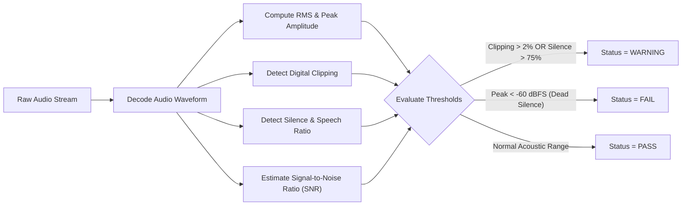

# Audio Technical Standard — Ingestion & Canonical Processing

## 1. Scope & Core Architectural Principle

The Tiv AI platform enforces a strict separation between **Ingestion Formats** (what contributors and browsers provide) and **Canonical ML Formats** (what machine learning training algorithms consume):

```
┌─────────────────────────────────────────────────────────────┐
│ 1. INGESTION FORMAT (Raw Contributed Audio)                 │
│    - Browser-native (WebM/Opus, MP4/AAC, WAV, MP3)          │
│    - Preserved unmodified in storage: raw/audio/...         │
│    - Immutable source of truth                              │
└──────────────────────────────┬──────────────────────────────┘
                               │ Automated Pipeline Conversion
                               ▼
┌─────────────────────────────────────────────────────────────┐
│ 2. CANONICAL DERIVED FORMATS (Target-Specific Derivatives)  │
│    - ASR Canonical: 16 kHz Mono 16-bit PCM WAV (ASR models) │
│    - TTS Canonical: 24/48 kHz High-Fidelity WAV (TTS models)│
│    - Preserved in storage: processed/audio/...              │
│    - Fully reproducible from raw source                     │
└─────────────────────────────────────────────────────────────┘
```

**CRITICAL RULE**: The original contributed file must **never** be overwritten, transcoded in place, or discarded. Preserving the original audio ensures that future advancements in acoustic modeling or higher-fidelity TTS requirements can re-derive artifacts without data loss.

---

## 2. Ingestion Format Specifications

To maximize accessibility for native speakers across diverse smartphones and computers, the platform accepts multiple standard browser and audio formats:

| Parameter | Specification | Allowed Range / Values |
| :--- | :--- | :--- |
| **Containers** | WebM, Ogg, MP4/M4A, WAV, MP3 | Binary magic bytes verified |
| **Codecs** | Opus, AAC, Linear PCM, MP3 | Standard speech codecs |
| **Channels** | Mono or Stereo | 1 or 2 channels (stereo downmixed during canonical processing) |
| **Sample Rate** | 16,000 Hz to 48,000 Hz | Common browser capture rates (typically 44.1 kHz or 48 kHz) |
| **Duration** | Minimum 0.5s, Maximum 120.0s | Target: 2.0s to 15.0s for sentence-level contributions |
| **File Size** | Minimum 1 KB, Maximum 25 MB | Enforced at API gateway |

---

## 3. Canonical Speech Recognition (ASR) Standard

For Automatic Speech Recognition (ASR) models such as Whisper, Conformer, and wav2vec 2.0, standardization eliminates acoustic variance and simplifies feature extraction:

| Parameter | Canonical ASR Specification | Rationale |
| :--- | :--- | :--- |
| **Container** | `WAV` (RIFF header) | Uncompressed, instant seekable access, zero decode latency |
| **Audio Format / Codec** | `pcm_s16le` (Linear PCM 16-bit Little-Endian) | Standard integer PCM representation across deep learning toolkits |
| **Channels** | `1` (Mono) | Speech recognition models operate on single-channel audio |
| **Sampling Rate** | `16,000 Hz` (16 kHz) | Nyquist rate captures up to 8 kHz, optimal for human speech frequencies |
| **Channel Downmixing** | `(L + R) / 2` | Equal-power averaging if original input was stereo |
| **Loudness Normalization** | EBU R128 (-23 LUFS) or Peak (-1.0 dBFS) | Prevents volume variations across different recording devices |

---

## 4. Text-to-Speech (TTS) Acoustic Considerations

**Do not blindly apply ASR downsampling to future TTS training data.**

- **Acoustic Fidelity**: High-quality neural speech synthesis (e.g. VITS, Piper, Bark) requires wideband audio at **22,050 Hz, 24,000 Hz, or 48,000 Hz** with 24-bit or 16-bit resolution to capture subtle phonetic formants, fricatives, and linguistic tone distinctions vital to the Tiv language.
- **Architectural Safeguard**: Because the platform permanently archives the raw upload in `raw/audio/`, TTS pipelines can isolate high-fidelity recordings and derive specialized 24 kHz or 48 kHz datasets directly from pristine sources.

---

## 5. Acoustic Quality Parameters & Thresholds

During ingestion, Developer 3's pipeline executes automated acoustic quality analyses:



### Thresholds & Evaluation Matrix:

1. **Dead Silence / Blank Audio**:
   - *Test*: Peak amplitude across the entire recording < -60 dBFS (or RMS < -65 dBFS).
   - *Action*: **FAIL** (Fatal). Rejected automatically; file is moved to quarantine.
2. **Excessive Silence**:
   - *Test*: Silent frames (energy < -40 dBFS) exceed 75% of total file duration.
   - *Action*: **WARNING**. Highlighted for human reviewer to inspect whether speaker paused excessively.
3. **Digital Clipping**:
   - *Test*: Percentage of samples at maximum numerical amplitude (0 dBFS).
   - *Threshold*:
     - `< 0.1%`: Acceptable (PASS).
     - `0.1% – 2.0%`: Mild clipping (WARNING). Reviewer notified of potential distortion.
     - `> 2.0%`: Severe clipping (FAIL / WARNING). Heavy distortion corrupts acoustic models.
4. **Signal-to-Noise Ratio (SNR)**:
   - *Test*: Estimated ratio of active speech energy to background noise floor.
   - *Target*: SNR ≥ 15 dB. Recordings with SNR < 10 dB receive an acoustic `WARNING` flag.

---

## 6. Normalization & Preprocessing Policy

When generating the canonical ASR derivative:
1. **Leading & Trailing Silence Trimming**: Up to 200ms of leading and trailing silence is retained as acoustic padding; silence exceeding 500ms at boundaries is trimmed.
2. **Peak Normalization**: Peak amplitude is scaled to **-1.0 dBFS** to prevent inter-sample clipping while maximizing signal resolution.
3. **Reproducibility**: The exact transformation parameters, resampling filter (`soxr` or `polyphase`), and software versions (e.g. `ffmpeg`, `torchaudio`, or `scipy`) are recorded in the processing provenance log.
