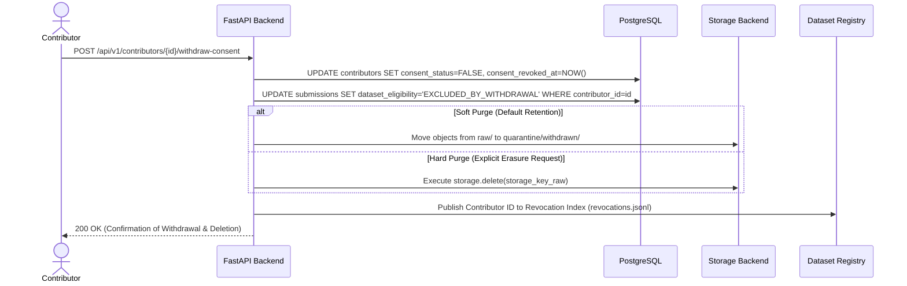

# Privacy, Consent & Data Governance Standard

## 1. Ethical Foundation & Regulatory Context

The Tiv language is an indigenous Nigerian language spoken by millions of people across Benue State, neighboring states, and the global diaspora. Preserving and promoting the language through artificial intelligence requires strict adherence to digital sovereignty, community trust, informed consent, and modern data privacy frameworks (including the **Nigeria Data Protection Act (NDPA)** and global standards such as the GDPR).

This standard establishes the data governance architecture required to maintain continuous, verifiable trust between community contributors and the Tiv AI platform.

---

## 2. Informed & Explicit Consent Framework

### 2.1 Consent Mandate
- **No Implicit Consent**: Submissions without explicit affirmative consent are strictly prohibited.
- **Pre-submission Gate**: Every contribution form on the frontend (Text, Translation, Voice) requires the contributor to actively check an informed consent declaration before the submission button is activated.
- **Unconsented Rejection**: If an API request arrives with `consent != true`, the backend must immediately reject the payload with `400 Bad Request`.

### 2.2 Standard Consent Declaration (Version `v1.0-2026-09`)
The user-facing consent text implemented across frontend forms states:
> *"I confirm that I am the author of or am authorized to share this contribution, and I grant the Tiv AI project a non-exclusive, perpetual, royalty-free license to use, process, and distribute this contribution for the purpose of language research, AI model development (including speech recognition, translation, and speech synthesis), and open linguistic dataset creation. I understand that my contributions will be reviewed and pseudonymously published in research datasets."*

### 2.3 Consent Provenance Fields
Every accepted submission permanently records:
1. `consent_status`: Boolean (`true`).
2. `consent_version`: String identifier (e.g. `"v1.0-2026-09"`).
3. `consent_timestamp`: ISO 8601 UTC timestamp of submission.
4. `consent_hash`: SHA-256 hash of the exact consent legal text presented to the user.

---

## 3. Contributor Identity & Data Minimization

To protect contributor privacy, the platform adheres strictly to the principle of **Data Minimization**:

1. **Pseudonymization by Default**:
   - Contributors are identified in the data pipeline exclusively by an opaque system identifier (`contributor_id`, e.g. `contrib_01h8q7j4...`).
   - Downstream dataset manifests (e.g. `TIV-DATASET-0001`) never expose real names, emails, telephone numbers, IP addresses, or device identifiers.
2. **Demographic Data Minimization**:
   - Demographic information is strictly **optional**.
   - Fields gathered (`age_range`, `region`, `dialect`, `gender`) are restricted to broad categorization buckets needed strictly for acoustic and linguistic balance.
   - No direct biometric markers or facial/voice identification registries are maintained.

---

## 4. Private Audio Access & Storage Security

All contributed audio represents sensitive community voice data. The storage infrastructure enforces zero-trust private access:

1. **Zero Public Buckets**:
   - The storage bucket / container has all public access blocked. No public URLs exist.
2. **Time-Limited Presigned Access**:
   - Reviewers and contributors access audio recordings exclusively through cryptographically signed, short-lived presigned URLs generated on demand by Developer 1's backend.
   - **Expiration Policy**: Presigned URLs expire after **15 minutes** (900 seconds) for reviewer listening sessions.
3. **Internal Pipeline Access**:
   - Background data processing jobs access storage objects using internal service credentials with strictly scoped least-privilege IAM roles.

---

## 5. Consent Withdrawal & Right-to-Erasure Workflow

Contributors reserve the right to withdraw their consent and request the deletion or exclusion of their contributions.

### Implications for Datasets:
- **Future Releases**: Any submission flagged with `EXCLUDED_BY_WITHDRAWAL` is immediately excluded from all future dataset versions.
- **Historical Releases**: Published datasets already distributed to research institutions are cryptographically frozen. For these releases, the project maintains an authoritative **Revocation Index** (`revocations.jsonl`) notifying downstream consumers to purge the revoked submission IDs from their local training splits.

---

## 6. Legal & Compliance Disclaimer

> [!WARNING] Legal Advisory Notice
> The specifications outlined in this document represent **engineering and architectural guidelines** for data privacy, storage isolation, and consent provenance. They do not constitute formal legal counsel. Prior to general public launch and public contributor recruitment, all terms of service, privacy disclosures, and consent statements must be submitted to qualified legal counsel licensed in Nigeria and relevant international jurisdictions to ensure comprehensive compliance with the Nigeria Data Protection Act (NDPA) and applicable regulations.
